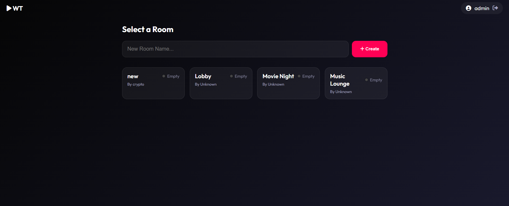

# Watch Together 🎬🍿

A real-time "Watch Party" application that allows users to create rooms, chat, and watch YouTube videos in perfect sync with friends.

## ✨ Features

-   **Real-Time Sync**: Video playback (Play, Pause, Seek) is synchronized across all users in a room.
-   **Multi-Room Support**: Create private rooms or join existing ones from the Lobby.
-   **Live Lobby Updates**: See active rooms and user counts update instantly without refreshing.
-   **User Authentication**: Sign Up and Login system with session persistence.
-   **Live Chat**: Text chat in every room to discuss the movie/video.
-   **Auto-Sync**: New users joining a room automatically jump to the current video timestamp.

## 🛠️ Tech Stack

-   **Frontend**: HTML5, CSS3 (Custom Design), JavaScript (ES6+).
-   **Backend**: Node.js, Express.js.
-   **Real-Time**: Socket.IO.
-   **Database**: MySQL (currently running via XAMPP).
-   **Video**: YouTube IFrame Player API.

## 🚀 How to Run Locally

1.  **Clone the Repo**:
    ```bash
    git clone https://github.com/yourusername/watch-together.git
    cd watch-together
    ```

2.  **Install Dependencies**:
    ```bash
    npm install
    ```

3.  **Database Setup**:
    -   Start **MySQL** (using XAMPP or similar).
    -   Create a database named `watch_together`.
    -   Import the provided SQL schema (or manually create `users` and `rooms` tables).

4.  **Run the Server**:
    ```bash
    node server.js
    ```

5.  **Open in Browser**:
    -   Visit `http://localhost:3000`

## 📸 Screenshots



## 📄 License

This project is for educational purposes.
